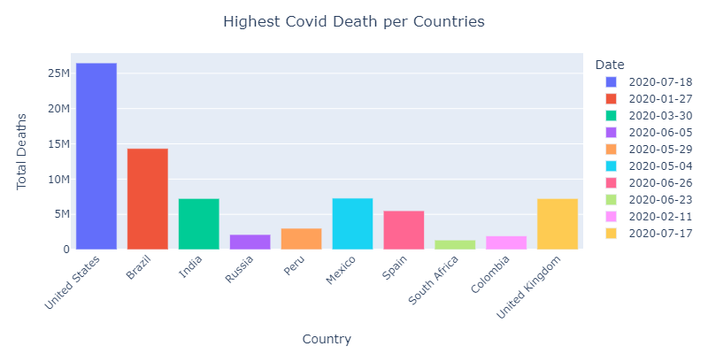

## Study of Covid-19 impacts on global economy.
A study of how Covid-19 has affected countries
on different level is proposed in a Python notebook.
The dataset used is the `Impact of Covid-19 Pandemic on the Global Economy` from Kaggle, and can be downloaded [here](https://www.kaggle.com/datasets/shashwatwork/impact-of-covid19-pandemic-on-the-global-economy).

---
### _Dataset_:
The dataset itself contains 2 datasets (_**the raw** and **transformed**_ dataset) a snippet of each is provided below : 
#### **The raw data** : 

| iso_code   | location    | date       |   total_cases |   total_deaths |   stringency_index |   population |   gdp_per_capita |   human_development_index | Unnamed: 9   | Unnamed: 10   | Unnamed: 11   |   Unnamed: 12 |   Unnamed: 13 |
|:-----------|:------------|:-----------|--------------:|---------------:|-------------------:|-------------:|-----------------:|--------------------------:|:-------------|:--------------|:--------------|--------------:|--------------:|
| AFG        | Afghanistan | 2019-12-31 |             0 |              0 |                  0 |     38928341 |          1803.99 |                     0.498 | #NUM!        | #NUM!         | #NUM!         |       17.4772 |       7.49775 |
| AFG        | Afghanistan | 2020-01-01 |             0 |              0 |                  0 |     38928341 |          1803.99 |                     0.498 | #NUM!        | #NUM!         | #NUM!         |       17.4772 |       7.49775 |
| AFG        | Afghanistan | 2020-01-02 |             0 |              0 |                  0 |     38928341 |          1803.99 |                     0.498 | #NUM!        | #NUM!         | #NUM!         |       17.4772 |       7.49775 |
| AFG        | Afghanistan | 2020-01-03 |             0 |              0 |                  0 |     38928341 |          1803.99 |                     0.498 | #NUM!        | #NUM!         | #NUM!         |       17.4772 |       7.49775 |
| AFG        | Afghanistan | 2020-01-04 |             0 |              0 |                  0 |     38928341 |          1803.99 |                     0.498 | #NUM!        | #NUM!         | #NUM!         |       17.4772 |       7.49775 |

#### **The transformed data** :

| CODE   | COUNTRY     | DATE       |   HDI |   TC |   TD |   STI |     POP |   GDPCAP |
|:-------|:------------|:-----------|------:|-----:|-----:|------:|--------:|---------:|
| AFG    | Afghanistan | 2019-12-31 | 0.498 |    0 |    0 |     0 | 17.4772 |  7.49775 |
| AFG    | Afghanistan | 2020-01-01 | 0.498 |    0 |    0 |     0 | 17.4772 |  7.49775 |
| AFG    | Afghanistan | 2020-01-02 | 0.498 |    0 |    0 |     0 | 17.4772 |  7.49775 |
| AFG    | Afghanistan | 2020-01-03 | 0.498 |    0 |    0 |     0 | 17.4772 |  7.49775 |
| AFG    | Afghanistan | 2020-01-04 | 0.498 |    0 |    0 |     0 | 17.4772 |  7.49775 |

---
### _Analysis result_:
The study has been done on 9 different levels, and below is 
a snippet of the resulting graphs (*__check notebook for a detailed implementation and explanation__*):
### 1. **Highest Covid-19 Cases among countries**

### 2. **Highest Covid-19 Deaths among countries**

### 3. **Highest Covid-19 Cases vs Highest Covid-19 Deaths amoung countries**

### 4. **Percentage of Total Deaths and Total Cases among countries**

### 5. **Stringency Index impact on Total Deaths and Total Cases among countries**

### 6. **GPG per capita before Covid-19**

### 7. **GPG per capita After Covid-19**

### 8. **GPG per capita before vs GPG per capita After Covid-19**

### 9. **HDI (Human Development Index) during Covid-19**

### Conclusion
We investigated the proliferation of covid-19 across countries as well as its impact on the global economy. We provided a detailed analysis and implementation of our approach. Here is the result of our findings: We discovered that the covid-19 outbreak resulted in the greatest number of covid-19 cases and deaths in the United States. One key explanation for this is the United States' stringency index which is quite low. We also looked at how each country's GDP per capita was affected by the covid-19 outbreak

### Installation

```
pip install python==3.7.6 
pip install pandas==1.4.2
pip install plotly==5.8.0
```
### Usage
```
Run notebook cells
```