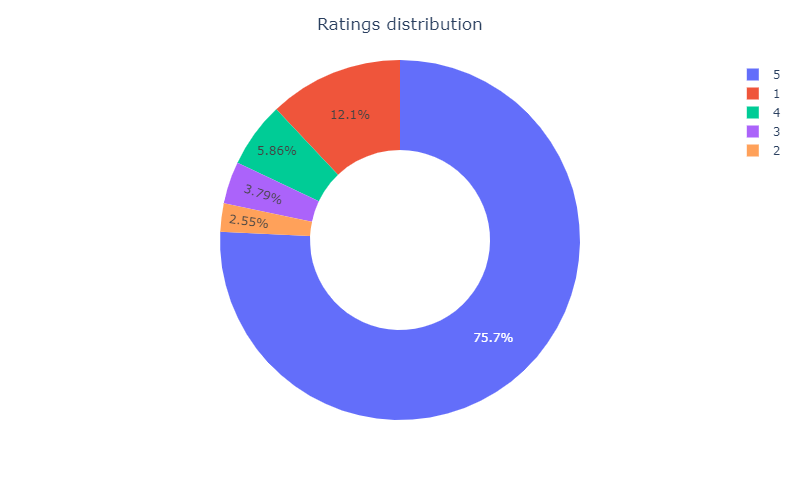
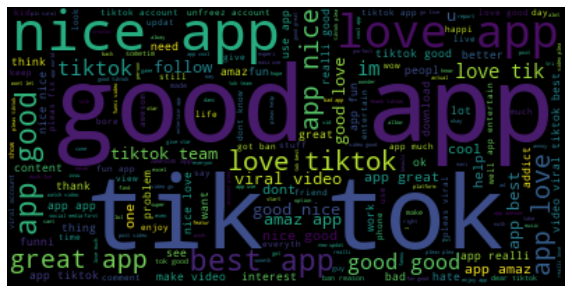
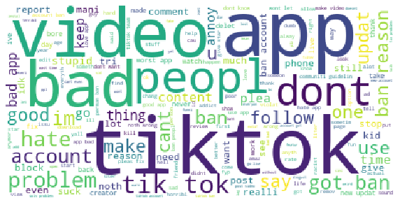
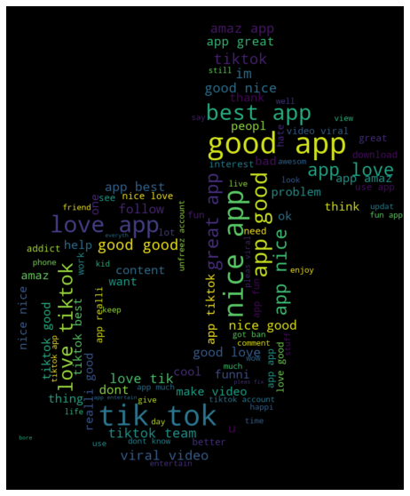

## <u>**Tiktok Review Analysis**</u>

__TikTok__ is a popular social media platform, that has gained a significant attention over the
the past years. Users on the App post short videos of all sorts. However as an Application, not
everyone will have the same comments and appreciation. Therefore, in this notbook, we study 
the review posted by users. The dataset __(can be downloaded [here]('https://www.kaggle.com/datasets/shivkumarganesh/tiktok-google-play-store-review'))__ is from __Kaggle__

### <u>_Dataset_</u>:
The dataset we are going to work with is represented as follows:

| reviewId                                                                                  | userName       | userImage                                                                               | content                                                                                                                                          |   score |   thumbsUpCount | reviewCreatedVersion   | at                  |   replyContent |   repliedAt |
|:------------------------------------------------------------------------------------------|:---------------|:----------------------------------------------------------------------------------------|:-------------------------------------------------------------------------------------------------------------------------------------------------|--------:|----------------:|:-----------------------|:--------------------|---------------:|------------:|
| gp:AOqpTOHRz-11c0apHLSKHHp52FxUXsQS9Z88wP3sWc5H1T4r3ccFkYWHOvawTjFZloIgujg2oEi4a7DdNsu7hg | MR LOL GAMER   | https://play-lh.googleusercontent.com/a/AATXAJznzcbhxCtAwdKBSjpJH6FmGfS38oOMtEiGb-zM=mo | Good                                                                                                                                             |       5 |               0 | 23.8.4                 | 2022-04-05 23:18:30 |            nan |         nan |
| gp:AOqpTOF6mFDEkIypmyT3shDLjPHg8zB3kdns2W36ahpXMnr9QRlEzfQqu3IDCSCWv7zbhIZUpp3smJ6cNUzwdA | Dino Kljako    | https://play-lh.googleusercontent.com/a-/AOh14Gi7mqbBAzp49TWD4EklBHoFrmEM8xfhFpzBhnN7NQ | Awesome app! Too many people on it where it's easier than fb. The girls are awesome and the guys, well, the guys wear toy masks. But we like it. |       5 |               0 | nan                    | 2022-04-05 23:18:21 |            nan |         nan |
| gp:AOqpTOGtqU4sb8vuVo3-eB7kIXWoBn-0YCUZ1SnPRKSMXDiVjCICjBnGiThSz31oBH8vjhkgfs17pozwQ7XWAw | Olivia Harding | https://play-lh.googleusercontent.com/a/AATXAJyja01iqwthNvK_kv40ZMH0q9My6RxLeVUsTiea=mo | Not bad                                                                                                                                          |       5 |               0 | 23.9.5                 | 2022-04-05 23:17:34 |            nan |         nan |
| gp:AOqpTOFHDm-Qa5R6jCpOGTFT2qr1_PKbCTbBNPahCEnFKG9861jXdrzxhJHVcWGoWBuwaW-X0i3Lp8MdJ87KVQ | Keli We        | https://play-lh.googleusercontent.com/a-/AOh14GjIzzpPhi7oG3ZXKkKqB072Zp-9mUhc6Uw0rUko   | It is good                                                                                                                                       |       2 |               0 | 22.2.5                 | 2022-04-05 23:17:04 |            nan |         nan |
| gp:AOqpTOFB6Ndao8IHRpOJRmbSknwMGxHcwYzux93YyXIcbVkHxprLmXnZWF1WGd3ev--Jt0t4t-MCn0yOVQt6Cw | Mavis Kotoka   | https://play-lh.googleusercontent.com/a/AATXAJwyQ1YmZynjOPvAPE_E_VO89J_iUWvqAwKf6y6x=mo | Very interesting app                                                                                                                             |       5 |               0 | 22.1.5                 | 2022-04-05 23:17:04 |            nan |         nan |

---
### <u>_Some Analysis Result_</u>:
### 1. **Ratings distribution**

### 2. **Review WordCloud distribution**

### 3. **Bad Review WordCloud distribution**

### 4. **TikTok logo WorldCloud**

### Conclusion
We analyzed the user's review for TikTok and designed a WordCloud based on the most frequent words.